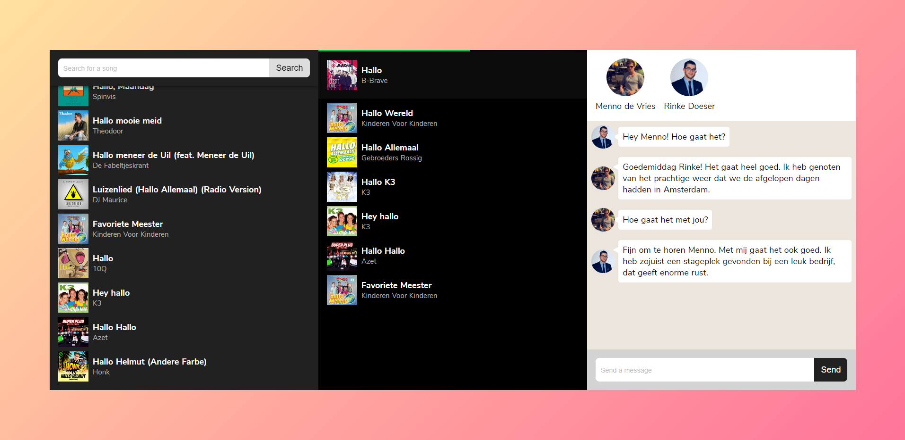
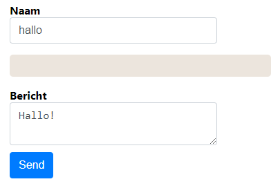
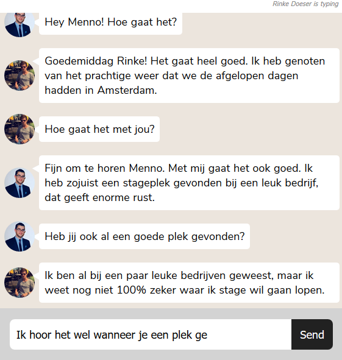
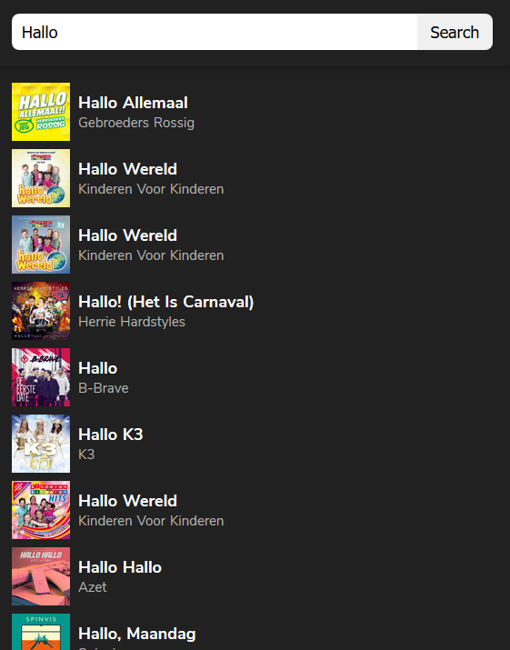

<h1 align="center">Real Time Web @cmda-minor-web 1819</h1>

<p align="center"><b>I want to listen to a playlist synchronously with my friends, in which everyone can search for songs and add them to a que. Meanwhile, we can send messages to eachother.</p></b>

<br>

<p align="center">
  <a href="https://play-spotify-together.herokuapp.com/">
    
  </a>
  &nbsp;&nbsp;&nbsp;
  <a href="https://github.com/Mennauu/real-time-web-1819/blob/master/LICENSE">
    
  </a>
</p> 

<br>



<br>

<!-- ☝️ replace this description with a description of your own work -->
## Introduction
This "Play Spotify Together" app is made as part of a course from [@cmda-minor-web 18-19](https://github.com/cmda-minor-web/real-time-web-1819). In this course I had to create a real time web application based on [sockets](https://socket.io/). 

Some resources possess an emoticon to help you understand which type of content you may find:

- 📖: Documentation or article
- 🛠: Tool, code or library
- 📹: Video

<!-- Maybe a table of contents here? 📚 -->
## Table of Contents

- [Setup and Installation](#setup-and-installation)
- [Learning process](#learning-process)
- [Play Spotify Together](#play-spotify-together)
  - [Authorization](#authorization)
  - [Users](#users)
  - [Messages](#messages)
  - [Searching](#searching)
  - [Adding](#adding)
  - [Playing](#playing)
- [Wishlist](#withlist)
- [Sources](#sources)
- [License](#license)

<!-- How about a section that describes how to install this project? 🤓 -->
## Setup and Installation

You will need to register your own Spotify App and set the credentials in a .env file.

1. Create an application on the [Spotify's Developer Site](https://developer.spotify.com/my-applications/).

2. Add redirect_uri in the Spotify Developer panel
```bash
http://localhost:3000/spotify/
```

3. Create a .env file. You can find the id and secret in the Spotify Developers panel.
```bash
CLIENT_URL=http://localhost:3000/
REDIRECT_URI=http://localhost:3000/spotify/
SPOTIFY_CLIENT_ID={{client_id}}
SPOTIFY_CLIENT_SECRET={{client_secret}}
```

4. Open your terminal

5. Change the directory to a folder in which you want to place the files
```bash
cd /~path
```
6. Clone the repository (you're going to need [Git](https://www.linode.com/docs/development/version-control/how-to-install-git-on-linux-mac-and-windows/))
```bash
git clone https://github.com/Mennauu/real-time-web-1819
```
7. Change directory to repository
```bash
cd real-time-web-1819
```
8. Install dependencies from [package.json](https://github.com/Mennauu/browser-technologies-1819/blob/master/package.json)
```bash
npm install
```

9. Place the .env file in the root folder

10. Run application with [Node](https://nodejs.org/en/)
```bash
node app.js
```

## Learning process
The goal was to learn about sockets before taking on the big challenge (which was to create this app)

<details>
  <summary>Read about my learning process</summary>

  I figured the fastest way to learn about sockets was to follow the [getting started example](https://socket.io/get-started/chat/) that socket.io provides, though I didn't want to use jQuery and I wanted to create it using [nuxt.js](https://nuxtjs.org/), since I also wanted to learn some more about Vue.js.

  The "tutorial" was easy to follow. After a couple of minutes I had a server running with multiple socket connections (of own browser tabs, ofcourse). I created a small design for a simple chat application.

  

  I added a couple of features (mentioned below) and had a nice looking chat application in the end.

  * Fill in a name
  * Sending a message was blocked for filling in a name
  * Send a message
  * I used https://robohash.org/${this.user} to get unique images per user
  * Every user had it's own chat message color

  As of writing this readme the chat application doesn't work anymore, and I didn't make any screenshots so I can't show the end result. I probably broke it trying to do some crazy stuff in Vue.

   ___

> * 🛠 [socket.io](https://socket.io/)
> * 🛠 [Nuxt.Js](https://nuxtjs.org/)
> * 📖 [Getting started with socket.io](https://socket.io/get-started/chat/)
> * 📖 [What Socket.IO is](https://socket.io/docs/)

</details>

## Play Spotify Together
With the Play Spotify Together app you can use your Spotify Account to search for songs and add them to a shared playlist in which you will listen to synchronously with other users of the app. You can also send messages to eachother.


### Authorization
To be able to use the app you need a Spotify Premium account. As soon as you hit the "Log in with spotify" button you will be redirected to Spotify's authentication process. On success you will be redirected to the 'inside' of the application.

To make this possible I had to create a new application at the [Spotify Developer site](https://developer.spotify.com/my-applications/). They provided me with a client id and a secret, which are used during the authentication process.

Spotify created their own [Web API Auth Example](https://github.com/spotify/web-api-auth-examples/tree/master/authorization_code). I used this authorization code flow as a base for the project.


### Users
Once you're authorized you will be connected as a socket. First a "new user" is emitted in which the socket gets a name and image based on the Spotify Account information that's been sent from the client. The information is stored in an array on the server. 

Your image and name will be directly shown on the screen, at the connected users section, for everyone. When you disconnect, your information that's stored in the array on the server will be removed and your image and name will dissapear immediately for everyone.


### Messages
There is one room in which all connected users are. If you type, everyone will be able to see that you are typing (at the top-right of the chatbox). If multiple people are typing, the message will mention the last user that started typing.

When the form on the client side is filled in, and "send" has been pressed, the message will go to the server (in which the username and image of the sender are also being sent) and return to all connected clients.



### Searching
We can make calls to the [Spotify Web API](https://developer.spotify.com/documentation/web-api/). I used the [Spotify Web API Node](https://www.npmjs.com/package/spotify-web-api-node) wrapper to help make the request. The wrapper isn't really necessary for the application in its current state, however if more data from the Spotify Web API is needed (later on) the wrapper will come in very helpfull.

Because we have an access token from the authorization process we can use this token to make calls. We only have to set it for the wrapper.

```JavaScript
spotifyApi.setAccessToken('<access_token>');
```
When the form on the client side is filled in, and "search" has been pressed, the data will go to the server and an API call to the Spotify Web API will be made based on the given data. The response will be like the object below.

```json
{
  "name": "Golpe Maestro",
  "popularity": 42,
  "preview_url":
    "https://p.scdn.co/mp3-preview/4ac44a56e3a4b7b354c1273d7550bbad38c51f5d",
  "track_number": 1,
  "type": "track",
  "uri": "spotify:track:3Qm86XLflmIXVm1wcwkgDK"
}
```

the server will return the response to the client once the response has been received. It will only be returned to the user (socket) that searched for the song in the first place.



### Adding
After searching for songs you can click on a result to add the song to the que (playlist). You can't add a song that's already in the que. 

When you click on a result the data from the clicked result is sent to the server and added to an array called 'queList' (on the server). Once the data has been added to the array, the data will be sent back to all connected clients. The data will be shown in the (shared) playlist.


### Playing
The oldest object in the 'queList' array will be the song that is being played. Once the song is done with playing on the client, a emit will be made to the server to remove the oldest object. This will only occur once per song, even if there are multiple users connected.

Each object contains an url to the song. This URL will be set as 'src' to an audio html tag on the client. There are checks to make this only happen when the currentTime of a song is 0 (finished). This is still buggy with multiple users, so it needs some revisioning.

A progress bar has been added so users can estimate how long the song will take and when it will end. The progress bar expands its width based on the duration the song has been played. The speed is based on the duration of the song. The width goes from 0% to 100%.


<!-- Maybe a checklist of done stuff and stuff still on your wishlist? ✅ -->
## Wishlist
- [ ] Add the 'active' queList on connect (now only happens on search or if a song is done playing on someone elses client)
- [ ] Fix the audio bug based on currenTime that occurs on the client
- [ ] Rewrite code - no jQuery and components based
- [ ] Play full songs

<!-- Maybe I used some awesome sources that I can mention 🤔-->
## Sources
Underneath you will find all the sources that were previously mentioned throughout the document and some others which were helpful.

> * 🛠 [socket.io](https://socket.io/)
> * 🛠 [Nuxt.Js](https://nuxtjs.org/)
> * 🛠 [Spotify Developer site](https://developer.spotify.com/my-applications/)
> * 🛠 [Web API Auth Example](https://github.com/spotify/web-api-auth-examples/tree/master/authorization_code)
> * 🛠 [Spotify Web API Node](https://www.npmjs.com/package/spotify-web-api-node)
> * 🛠 [Audio Progress Bar](https://codepen.io/mdf/pen/ZWbvBv)
> * 🛠 [Color Hex](https://www.color-hex.com)
> * 🛠 [Heroku](https://www.heroku.com)

> * 📖 [Getting started with socket.io](https://socket.io/get-started/chat/)
> * 📖 [What Socket.IO is](https://socket.io/docs/)
> * 📖 [Spotify Web API](https://developer.spotify.com/documentation/web-api/)
> * 📖 [How can I get the html5 audio's duration time](https://stackoverflow.com/questions/11203773/how-can-i-get-the-html5-audios-duration-time)
> * 📖 [Creating A Spotify-Powered App Using Nuxt.js](https://www.smashingmagazine.com/2019/03/spotify-app-vue-nuxt-javascript/#top)
> * 📖 [Scroll to bottom of Div on page load (jQuery)](https://stackoverflow.com/questions/10503606/scroll-to-bottom-of-div-on-page-load-jquery)
> * 📖 [How do you detect when HTML5 audio has finished playing](https://stackoverflow.com/questions/11103582/how-do-you-detect-when-html5-audio-has-finished-playing-more-than-once)
> * 📖 [Remove duplicates from an array of objects in JavaScript](https://stackoverflow.com/questions/2218999/remove-duplicates-from-an-array-of-objects-in-javascript)


<!-- How about a license here? 📜 (or is it a licence?) 🤷 -->
## License 
See the [LICENSE file](https://github.com/Mennauu/browser-technologies-1819/blob/master/LICENSE) for license rights and limitations (MIT).
